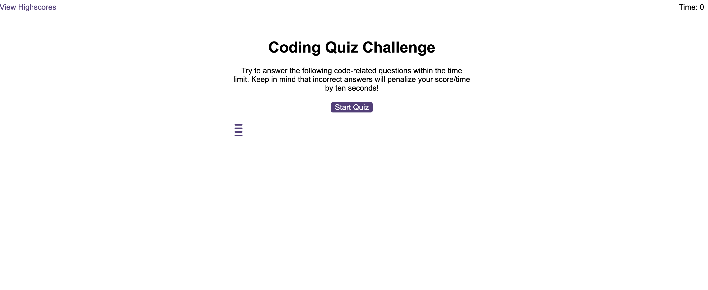
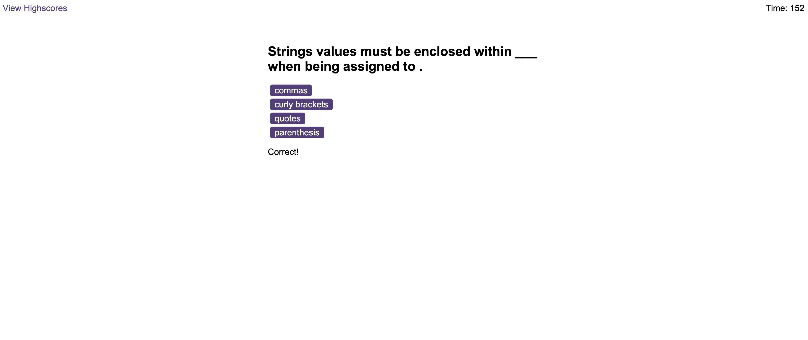
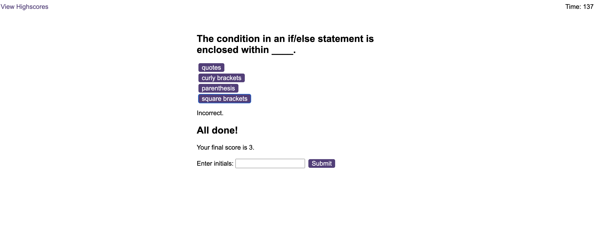

# Web API Code Quiz
This repository contains a timed coding Java Script quiz with multiple-choice questions for Web Development Bootcamp students.

## Description

Java Script quiz runs for a set time timit, stores high scores and displays them after the quiz is finished. Questions contain buttons for each answer. When answer is clicked, the next question appears. Each incorrect answer will result in subtraction of remaining time. After quiz is done or time limit for the quiz is finished user is asked to submit initials that are stored together with scores in local storage.
This app runs in the browser and features dynamically updated HTML and CSS powered by JavaScript.  

## Installation
N/A

## Usage 
This webpage is deployed  at live URL, you can access it using: https://web3cryptoidea.github.io/java-script-quiz/

It looks like this:

 

 

 

 
 

 
## Credits

- Web APIs [Mozilla MDM tutorial 1](https://developer.mozilla.org/en-US/docs/Learn/JavaScript/Client-side_web_APIs/Introduction)
- JavaScript functions [Mozilla MDM tutorial 2](https://developer.mozilla.org/en-US/docs/Web/JavaScript/Guide/Functions).

## License
Please refer to the LICENSE in the repo.

 
 

  